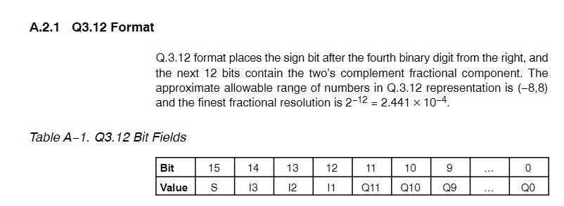

# liquid小数支持探究

## 小数简介

​	在计算机中小数常有定点和浮点两种表示方法。

### 定点数

​	定点数为小数点位置固定的小数表示方法。

​	**参考：**

> https://zh.wikipedia.org/wiki/%E5%AE%9A%E9%BB%9E%E6%95%B8%E9%81%8B%E7%AE%97

#### 定点数一般表示方法

定点数一般有BCD、系数缩放以及Q格式三种表示方法，其中BCD表示方法已经被工业界抛弃，这里只描述仍在使用的系数缩放和Q格式表示方法。

#### 参考

> https://zh.wikipedia.org/wiki/%E5%AE%9A%E9%BB%9E%E6%95%B8%E9%81%8B%E7%AE%97

（中文比英文描述更为详细）

##### 系数缩放

​	通过将小数缩放一定的倍数，使得小数能够通过整数进行表示。常见的倍数为2^N^或10^N^。

##### Q格式

​	左右两边分别表示整数和小数，除符号位均使用位权2^N^，以小数点左右两边分开，左边整数部分为N=1...M, 右边小数部分为N=-1...M。采用泰勒展式的累加求和进行表示，有限位数会出现表示不准确的结果。

###### 参考

> https://www.ti.com/lit/ug/spru565b/spru565b.pdf

### 浮点数表示

​	浮点数为工业界常用小数表示方法，常见标准为IEEE754—2008。标准中规定浮点数采用S（符号位）+E（指数）+F（尾数）进行表示。

#### 	**参考**

> https://en.wikipedia.org/wiki/IEEE_754#CITEREFIEEE_7542019

### 浮点数和定点数的比较

​	如果说要使用小数，在精度允许的情	况，推荐使用定点数（效率更高）。

> https://zhuanlan.zhihu.com/p/149517485

## 定点数实现方案

​	定点数一定可以在计算机中精确表示，故可以在调研后提出方案。

​	最后放弃的原因：最好的方案为缩放一定的倍数，微众方认为该方案实现简单且功能较为鸡肋。放弃后调研浮点数是否可以实现。

### 最终确定

​	最后确定的方案是采用struct作为定点数的存储方式

​	编解码采用大端法按顺序进行编解

​	计算：

- 加减法：整数和小数部分分别进行加减，且最好规定小数点位数为6位（满足进位需求，小数部分结果为7位时则进位）
- 乘法：(a+b)(c+d)
- 除法：最好的算法为分别对整数和小数部分进行等倍数缩放（如10^6^），然后进行累加。

**注：**

不可以对整数部分乘以2^20^后叠加小数，得到的结果没有任何意义。

### 个人推荐实现

​	实现方法同solidity和vyper，才存储时即方法10^6^。

#### 思量

​		如果采用这种方式的话，需要考虑如何将字符串的数值乘以10^N^，现在的想法，统计小数点后的非0位数（设为M），并找到小数点后去除小数点，然后乘以10^N-M^。

#### 计算

​	直接转化为uint128进行计算。

#### 参考

> https://ethereum.stackexchange.com/questions/83785/what-fixed-or-float-point-math-libraries-are-available-in-solidity

solidity定点数实现的一些库。

