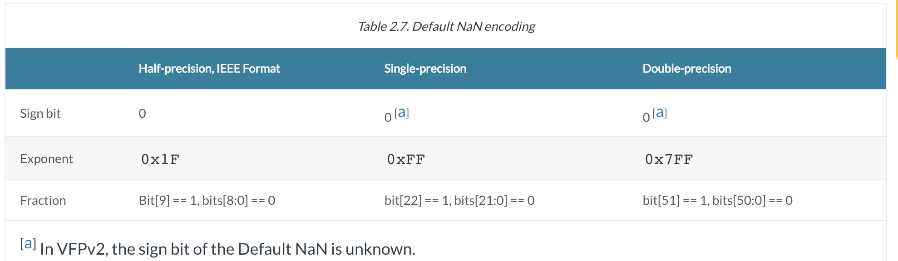
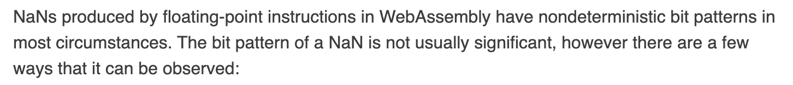
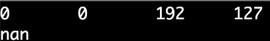
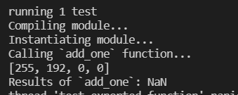
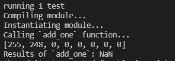
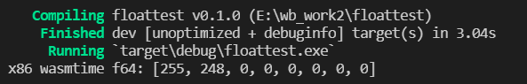
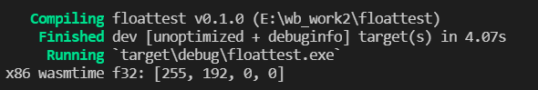
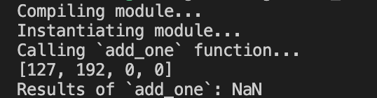
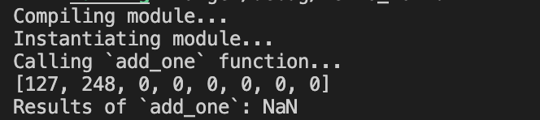
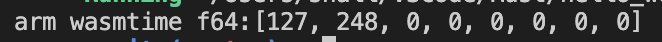

# 不同架构下浮点数表示的一致性问题探究

## 一、结论

在不同平台下，wasm中**NaN**的符号位表示存在**区别**，Rust编译的wasm能保证在不同架构上（x86&ARM）的不同平台（Wasmer、Wasmtime&Chrome v8）的结果一致性，而C++和手写的Wasm不能保证。


## 二、相关信息

### 2.1 浮点数运算基本定义

**计算机组成原理说明：**浮点数运算对于不同的芯片上的计算结果存在不确定性。

**运算说明**：与IEEE754标准对齐的架构都能实现IEEE754定义的基本运算。

### 2.2 WebAssembly中NaN相关问题

#### （1）ARM中NaN表示存在不确定性

**来源：[ARM Developer](https://developer.arm.com/documentation/ddi0406/c/Application-Level-Architecture/Application-Level-Programmers--Model/Floating-point-data-types-and-arithmetic/NaN-handling-and-the-Default-NaN?lang=en)**

**结论：**对于VFPv2芯片，NaN的表示方法中符号位的数值**未知**。




#### （2）Wasm中浮点数表示存在不确定性

**来源：[WebAssembly官网](https://webassembly.org/docs/faq/)**

**结论：** 由于Wasm的优化，Wasm假设不存在**NaNs**和**infinities**，忽略了**-0**和**+0**的区别，数字的溢出和进位会产生不同（不确定）的处理

，导致了Wasm中浮点表示的**不确定性（nondeterminism）**。


**来源：[WebAssembly github](https://github.com/WebAssembly/design/blob/main/Nondeterminism.md)**

**结论：** 当算术运算返回NaN时，对应在Wasm中的表示是不确定的（nondeterminism）。


**来源：Github issues**

[issue1](https://github.com/WebAssembly/design/issues/1385)

[issue2](https://github.com/WebAssembly/design/issues/1384)

**结论：**Wasm中除了NaN，浮点表示都是确定的。

**来源：[Wasm 官方doc](https://www.wasm.com.cn/docs/rationale/)**



**结论：**NaN 表示方式不确定。

## 三、实证研究

### 3.1 NaN是否存在不确定性

**结论：**

对于Rust编译而成的Wasm而言，运算产生`NaN`的情况只有`0.0/0.0`，其中`NaN`的`f32`表示在两种架构中表示均为`[127, 192, 0, 0]`，`f64`表示均为`[127, 248, 0, 0]`。

所有有关NaN的运算在ARM和x86结构的三种环境下运行结果和表示均相同。

而对于C++编译而成Wasm而言，在Chrome v8下运行产生的NaN的表示**有别**，即符号位**相反**。

对于手写的WAT而言，其在不同架构（Wasmer和Wasmtime）的相同运行环境下的结果**有别**，符号位**相反**。

总结**一致性**表格如下：

| 语言    | Wasmer | Wasmtime | Chrome v8 |
| ------- | ------ | -------- | --------- |
| Rust    | √      | √        | √         |
| C++     |        |          | ✕         |
| 手写wat | ✕      | ✕        |           |

具体结果如下，以`f32`中的`NaN`表示为例：

| 语言    | Wasmer                                                      | Wasmtime                                                     | Chrome v8                                                    |
| ------- | ----------------------------------------------------------- | ------------------------------------------------------------ | ------------------------------------------------------------ |
| Rust    | 均为[127, 192, 0, 0]                                        | 均为[127, 192, 0, 0]                                         | 均为[127, 192, 0, 0]                                         |
| C++     |                                                             |                                                              | x86：[255, 192, 0, 0]<br/>ARM:[127, 192, 0, 0]<br/>符号位有别 |
| 手写wat | x86：[255, 192, 0, 0]<br>ARM:[127, 192, 0, 0]<br>符号位有别 | x86：[255, 192, 0, 0]<br/>ARM:[127, 192, 0, 0]<br/>符号位有别 |                                                              |

#### 3.1.1 测试思路

1.测试环境

- ARM
- x86

2.测试RunTime

- wasmer
- wasmtime
- chrome v8

3.测试代码

- Rust编译后的Wasm
- C++编译后的Wasm
- 手写Wat

#### 3.1.2 Rust编译的Wasm测试

测试代码

```rust
fn main() {
    let nan = 0.0_f32 / 0.0;
    println!("nan: {:?}", nan.to_be_bytes());
  	// 相关运算测试
  	// ...
}
```

测试结果：

1.Rust编译后的Wasm在同一个架构下不同运行环境中的结果相同

2.Rust编译后的Wasm在不同架构下的同一运行环境中结果相同

**以f32::NAN为例，x86和ARM下不同运行环境结果均为：**


#### 3.1.3 C++编译的Wasm测试

测试代码

```c++
#include <iostream>
#include <string>

using namespace std;

int main(int argc, char ** argv) {
  float nan1 = 0.0;
  float nan2 = 0.0;
  float nan3 = (nan1 / nan2); 
  unsigned char charArray[4];
  unsigned char *pdatas = (unsigned char *)&nan3;
  for (int i = 0; i < 4; i++){
    charArray[i] = *pdatas++;
    printf("%d\t", int(charArray[i]));
  }
  cout << endl;
  cout << to_string(nan3) << endl;
  return 0;
}
```

测试结果：

1.C++编译后的Wasm在同一个架构下不同运行环境中的结果相同

2.C++编译后的Wasm在不同架构下的同一运行环境中结果**不相同（chrome v8下运行结果不同）**

**x86下**chrome v8


**ARM下**chrome v8



#### 3.1.4 手写WAT测试

测试代码

```rust
(module
            (type $add_one_t (func (param f32) (result f32)))
            (func $add_one_f (type $add_one_t)  (param $value f32) (result f32)
              local.get $value
              f32.const 0.0
              f32.div)
            (export "add_one" (func $add_one_f))
          )

(module
            (func $add_one_f (result f32)
              f32.const 0.0
              f32.const 0.0
              f32.div)
            (export "add_one" (func $add_one_f))
          )
```

测试结果：

1.在同一个架构下不同运行环境中的结果相同

2.在不同架构下的同一运行环境中结果**不相同**

**x86下**

1.wasmer（f32和f64）





2.wasmtime（f32和f64）






**ARM下**

1.wasmer（f32和f64）





2.wasmtime（f32和f64）




